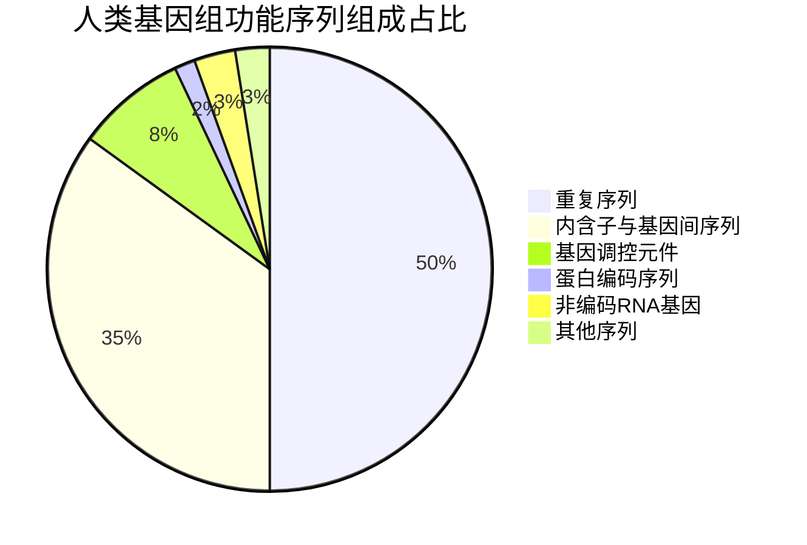
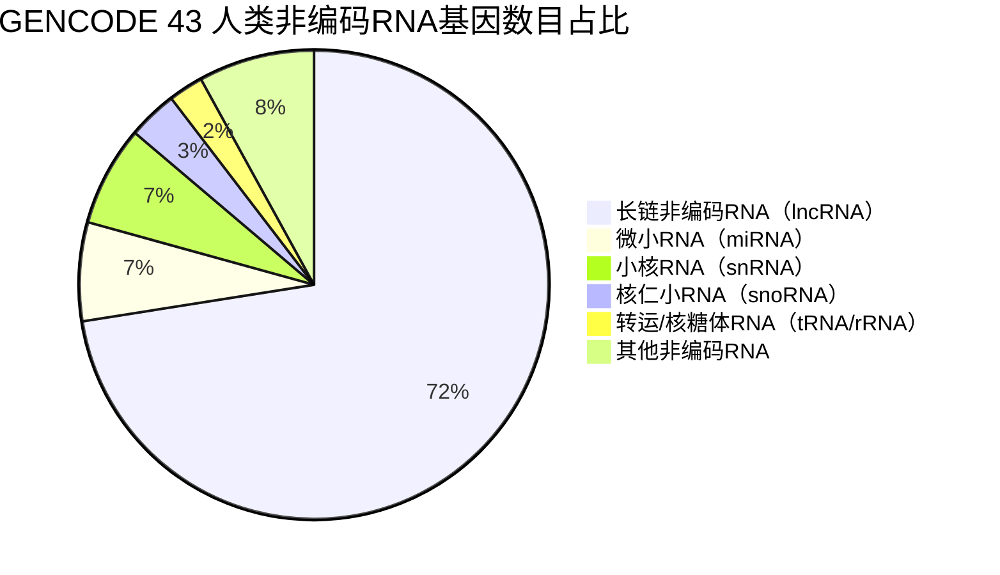

# 人类基因组组成与非编码RNA最新注释报告

---

## 1. 人类基因组的大小以及基本组成
人类基因组分为**核基因组**和**线粒体基因组**两部分，目前国际通用两个主流参考基因组版本：广泛使用的GRCh38.p14版本，以及首个完整无间隙的T2T-CHM13v2.0版本，核心参数与组成如下。

### 1.1 人类基因组的大小（权威版本量化数据）
| 参考基因组版本 | 发布/注释更新时间 | 核基因组总大小 | 线粒体基因组大小 | 总基因组大小 | 官方数据来源 |
| :--- | :--- | :--- | :--- | :--- | :--- |
| GRCh38.p14（主流通用版） | 基因组发布：2022年3月 最新注释：2024年8月 | 3,099,734,149 bp（约3.10 Gb） | 16,569 bp | 约3.10 Gb | NCBI RefSeq Annotation Release GCF_000001405.40-RS_2024_08  |
| T2T-CHM13v2.0（完整无间隙版） | 基因组发布：2022年1月 最新注释：2024年8月 | 3,054,815,472 bp（约3.05 Gb） | 16,569 bp | 约3.05 Gb | NCBI RefSeq Annotation Release GCF_009914755.1  |

> 补充说明：T2T-CHM13版本填补了GRCh38中约8%的序列缺口，完整覆盖了染色体着丝粒、端粒、高度重复序列等传统测序无法解析的区域，纠正了GRCh38中的数千个结构错误。

### 1.2 人类基因组的基本组成
#### 1.2.1 结构组成
人类基因组由两个独立的遗传体系构成：
1.  **核基因组**：人类遗传信息的核心载体，位于细胞核内，单倍体形式为**22条常染色体 + X、Y 2条性染色体**（共24条线性染色体）；二倍体体细胞中为23对（46条）染色体。
2.  **线粒体基因组**：位于细胞质线粒体中，为**闭合环状双链DNA分子**，全长固定为16569 bp，共编码37个基因（2个线粒体rRNA、22个线粒体tRNA、13个氧化磷酸化相关蛋白编码基因），遵循母系遗传规律。

#### 1.2.2 功能序列组成
基于GENCODE Release 43（2026-01-13）最新注释，人类基因组的功能序列占比与组成如下：
- **蛋白编码序列**：仅占全基因组的~1.5%，对应19393个蛋白编码基因，是人类蛋白质组的编码模板。
- **非编码序列**：占全基因组的98%以上，是基因组的主要组成部分，具体包括：
  - 非编码RNA基因：占基因组的~3%，编码不翻译为蛋白质的功能性RNA分子；
  - 基因调控元件：占基因组的~5-10%，包括启动子、增强子、沉默子等顺式调控元件，调控基因的时空特异性表达；
  - 内含子与基因间序列：占基因组的~30%，是蛋白编码基因中的非编码间隔序列与基因间的间隔区域；
  - 重复序列：占基因组的50%以上，包括转座子（LINE、SINE等）、串联重复序列、片段重复等，是基因组进化与多样性的核心来源。

### 1.3 人类基因组组成可视化

---

## 2. 人类基因组中非编码RNA的最新注释与功能解析
非编码RNA（ncRNA）是指不编码蛋白质、但具有明确生物学功能的RNA分子，根据长度、定位与功能可分为多个类别，以下为国际权威数据库的最新注释数据与功能解读。

### 2.1 非编码RNA最新注释总数（权威版本对比）
| 数据库/注释版本 | 更新时间 | 总非编码RNA基因数目 | 长链非编码RNA（lncRNA）数目 | 小非编码RNA（sncRNA）数目 | 官方来源链接 |
| :--- | :--- | :--- | :--- | :--- | :--- |
| GENCODE Release 43 | 2026年1月13日 | 27494个 | 19928个 | 7566个 | https://www.gencodegenes.org/human/stats_43.html  |
| NCBI RefSeq GRCh38.p14 | 2024年8月26日 | 22107个 | 17793个 | 4314个 | https://www.ncbi.nlm.nih.gov/refseq/annotation_euk/Homo_sapiens/GCF_000001405.40-RS_2024_08/  |
| Ensembl Release 115 | 2025年9月 | 26374个 | 18874个 | 7500个 | https://www.ensembl.org/Homo_sapiens/Info/Annotation  |

> 注：GENCODE为国际人类和小鼠基因组注释的金标准，由Ensembl与Wellcome Sanger Institute联合维护，数据时效性与准确性最高，以下细分类型统计均基于GENCODE Release 43（2026-01-13）最新版本。

### 2.2 非编码RNA细分类型的注释数目
| 非编码RNA大类 | 具体亚型 | 基因注释数目 | 核心特征 |
| :--- | :--- | :--- | :--- |
| **长链非编码RNA（lncRNA）** | 基因间lncRNA（lincRNA）、反义lncRNA、内含子lncRNA、正义重叠lncRNA | 19928 | 长度＞200nt，是数量最多的非编码RNA类型 |
| **小非编码RNA（sncRNA，长度＜200nt）** | 微小RNA（miRNA） | 1879 | 长度~22nt，转录后调控核心分子 |
|  | 小核RNA（snRNA） | 1901 | 定位于细胞核，剪接体核心组分 |
|  | 核仁小RNA（snoRNA） | 942 | 定位于核仁，rRNA修饰核心分子 |
|  | 核糖体RNA（rRNA） | 47 | 核糖体核心结构与功能组分 |
|  | 核编码转运RNA（tRNA） | 603 | 蛋白质翻译的氨基酸载体 |
|  | 线粒体rRNA（Mt_rRNA） | 2 | 线粒体基因组编码，参与线粒体内翻译 |
|  | 线粒体tRNA（Mt_tRNA） | 22 | 线粒体基因组编码，参与线粒体内翻译 |
|  | 小 Cajal 体特异性RNA（scaRNA） | 49 | 定位于Cajal体，参与snRNA修饰 |
|  | 核酶（ribozyme） | 8 | 具有催化活性的RNA分子 |
|  | 穹窿体RNA（vault_RNA） | 1 | 穹窿体复合物的核心组分 |
|  | 信号识别颗粒RNA（scRNA） | 1 | 参与蛋白分泌的信号识别 |
|  | 其他杂项RNA（misc_RNA） | 2212 | 功能未完全明确的其他非编码RNA |

### 2.3 主要非编码RNA的核心功能（1-2句精准解释）
1.  **长链非编码RNA（lncRNA）**：长度大于200nt的非编码RNA，可通过染色质重塑、转录干扰、mRNA稳定性调控等多种机制，在表观遗传、转录及转录后水平调控基因表达，广泛参与胚胎发育、细胞分化、肿瘤发生等生理病理过程。
2.  **微小RNA（miRNA）**：长度约22nt的单链小非编码RNA，通过与靶基因mRNA的3'非翻译区（3'UTR）互补配对，介导mRNA降解或翻译抑制，是真核生物基因表达转录后调控的核心分子，几乎参与所有细胞生命活动。
3.  **小核RNA（snRNA）**：长度100-300nt，主要定位于细胞核内，是真核生物剪接体的核心组成成分，负责识别pre-mRNA的剪接位点，介导内含子的剪切与外显子的连接，保障mRNA的正确成熟。
4.  **核仁小RNA（snoRNA）**：主要定位于核仁，分为C/D盒和H/ACA盒两大亚类，分别指导核糖体RNA（rRNA）的2'-O-甲基化修饰和假尿嘧啶化修饰，调控核糖体的生物合成与功能成熟。
5.  **核糖体RNA（rRNA）**：是核糖体的核心结构与催化组分，与核糖体蛋白共同构成蛋白质翻译机器，占细胞总RNA的80%以上，是维持翻译体系正常运转的核心骨架。
6.  **转运RNA（tRNA）**：长度70-90nt的三叶草结构RNA，在蛋白质翻译过程中作为氨基酸的转运载体，通过反密码子识别mRNA上的密码子，将对应的氨基酸递送至核糖体，完成多肽链的合成。
7.  **线粒体非编码RNA（Mt_rRNA/Mt_tRNA）**：由线粒体基因组独立编码，不依赖核基因组转录体系，是线粒体内翻译系统的核心组分，负责线粒体氧化磷酸化相关蛋白的合成，其突变与线粒体遗传病、衰老、肿瘤密切相关。

### 2.4 非编码RNA类型占比可视化

---

